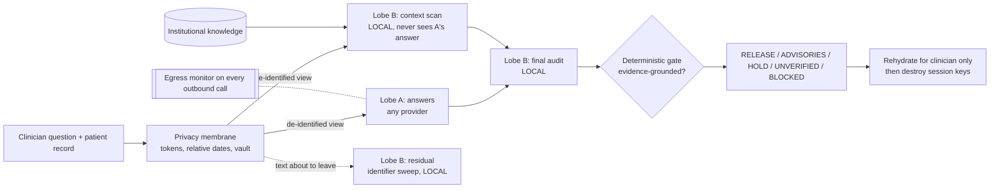

# Dual-Lobe Clinical Safety

A clinical inference proxy built from the generic
[Dual-Lobe runtime](https://github.com/anasalsawy/dual-lobe-proxy). Clinicians
often ask a narrow question while the patient's record holds the thing that
matters. This proxy adds an **independent, local supervisory lobe** that reads
the whole record, not only what was asked. It also adds a **deterministic
release gate** and a **privacy membrane**, so the answering model never learns
who the patient is.

> Research software. Not a medical device and not for patient care.

## Architecture



* **Lobe A** answers the clinician's question. It can be a large remote model
  because it only ever sees de-identified data.
* **Lobe B** must be a **local** model. It runs:
  1. a residual identifier sweep over text about to leave;
  2. an independent context scan, concurrent with A and without seeing A's
     answer: allergies, interactions, organ function, pregnancy, age,
     unaddressed abnormal results, red flags, missing information;
  3. a final audit of A's exact answer. B never rewrites A's answer.
* **Gate.** Findings must cite record facts (`[F#]`) with verbatim quotes, and
  every citation is machine-checked. Only grounded critical/major findings can
  interrupt the clinician. Fabricated evidence can never interrupt. If the
  supervisor fails, the answer is marked `UNVERIFIED`, never passed.
* **Privacy.** Per-request random tokens, AES-256-GCM vault, HMAC lookup with
  no plaintext index, dates as offsets (`T-14d`), ages 90+. A two-layer
  egress monitor checks every outbound payload by destination. Keys are
  destroyed after every request (crypto-shredding). A privacy receipt comes
  with every answer.

## Documents

| | |
|---|---|
| [paper/jbhi/manuscript.tex](paper/jbhi/manuscript.tex) | New JBHI manuscript, IEEEtran (compile on Overleaf; model-study results pending) |
| [paper/jbhi/COVER_LETTER.md](paper/jbhi/COVER_LETTER.md) | Cover letter for the new submission |
| [docs/REPORTING_CHECKLIST.md](docs/REPORTING_CHECKLIST.md) | DECIDE-AI and TRIPOD-LLM alignment |
| [benchmarks/clinical/DATASHEET.md](benchmarks/clinical/DATASHEET.md) | Benchmark datasheet: composition, provenance, limitations |
| [docs/REVIEWER_RESPONSE.md](docs/REVIEWER_RESPONSE.md) | Every reviewer requirement quoted, where it is met, and its status |
| [docs/METHODS.md](docs/METHODS.md) | Formal control logic, disagreement policy, evidence retrieval, failure taxonomy |
| [docs/PRIVACY.md](docs/PRIVACY.md) | Privacy design, guarantees and limitations |
| [docs/RELATED_WORK.md](docs/RELATED_WORK.md) | Comparison with verifier, guardrail, debate, AI-control and CDS approaches; 45 references |
| [docs/EVALUATION.md](docs/EVALUATION.md) | Hypotheses, study design, evidence so far, how to run |

## Evidence so far

* **Release gate:** safety invariants verified over all 50,568 enumerated
  input configurations (`tests/test_gate_exhaustive.py`).
* **Privacy audit** (133 cases, 626 planted identifiers): 0 deterministic
  leaks, 2 left for the local sweep by design, 385/385 clinical values
  preserved, all sessions crypto-shredded (`results/privacy_audit.json`).
* **End-to-end tests at the provider boundary:** no identifier reaches the
  remote lobe; all B calls stay local; a remote B is refused.
* **Model-performance study** (omission sensitivity and false holds versus
  A-only and versus a conventional answer verifier): harness ready, not yet
  run. No performance numbers are claimed.

## Quick start

```bash
pip install -e .
cp .env.example .env
# Lobe B must be local, e.g.:  ollama pull llama3.1:8b
#   DUAL_LOBE_B_MODEL=ollama/llama3.1:8b
# Lobe A: any provider
#   DUAL_LOBE_A_MODEL=...   DUAL_LOBE_A_API_KEY=...

dual-lobe-clinical --question "What ibuprofen dose for his knee OA?" \
                   --record patient.json --show-meta

pytest -q                                   # 94 tests
python evaluation/privacy_audit.py          # deterministic privacy audit
python evaluation/run_study.py --repeats 3  # model study (needs models)
python evaluation/score.py results/study_<stamp>.jsonl --export-adjudication results/adjudication
python evaluation/adjudication.py results/adjudication/adjudication_key.json rater1.csv rater2.csv
```

The record can be JSON of any shape, or a plain-text note.

## Repository layout

```
src/dual_lobe_crewai/    generic Dual-Lobe runtime (A, B, delegation, live B, anti-deception)
src/dual_lobe_clinical/  clinical layer
  privacy.py             de-identification session, vault, receipt
  egress.py              destination-based egress monitor
  locality.py            local-B enforcement
  engine.py              clinical orchestration
  control.py             grounding + release gate (deterministic)
  knowledge.py           evidence retrieval
  prompts.py, models.py
benchmarks/clinical/     133-case omission benchmark (85 hazard, 48 controls incl. 40 matched twins), datasheet
evaluation/              privacy audit, study runner, scorer
docs/                    methods, privacy, related work, evaluation, reviewer response
```

The generic runtime is kept intact apart from two small hooks: explicit
provider specs and egress filters in `run_one`, plus domain context and B
specs for the live monitor. `dual-lobe` still works as before.
